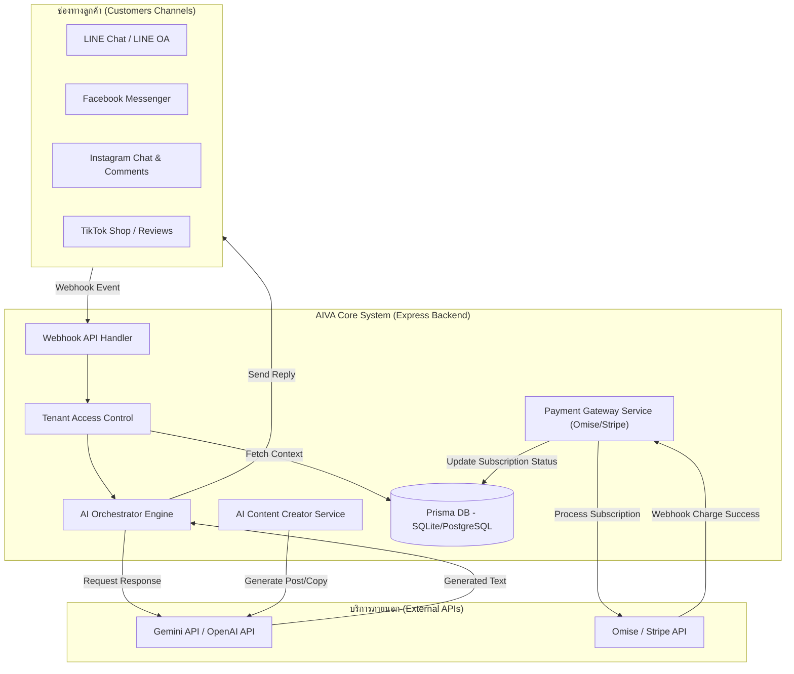
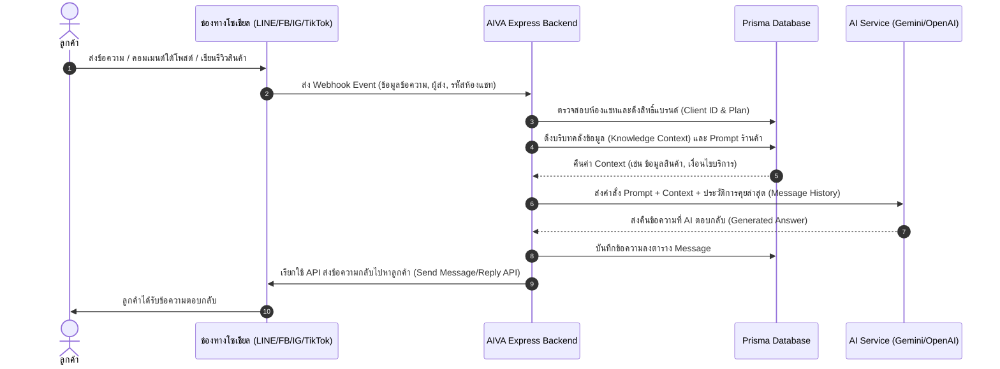

# แผนภาพสถาปัตยกรรมและรายละเอียดการเชื่อมต่อ AI & Payment สำหรับ AIVA
(AI Engine, Social Channels & Payment Gateway Integration Blueprint)

เอกสารฉบับนี้จัดทำขึ้นเพื่อแสดงโครงสร้างทางสถาปัตยกรรม (Architectural Blueprint) และทิศทางการพัฒนาในการเชื่อมโยงระบบหลังบ้านของ AIVA เข้ากับบริการปัญญาประดิษฐ์ (AI Engines), แพลตฟอร์มโซเชียลมีเดียหลัก (LINE, FB, IG, TikTok) และเกตเวย์ชำระเงินจริง (Payment Gateway)

---

## 1. ผังระบบโดยรวม (System Architecture Overview)



---

## 2. การเชื่อมต่อ AI Engine & ระบบตอบแชท/รีวิวอัตโนมัติ

ระบบจะดึงบริบทแบรนด์ (Brand Persona) และคลังข้อมูลที่ถูกสอน (Knowledge Base Context) มาประกอบเป็นคำสั่ง (Prompt Tuning) ส่งให้ AI ประมวลผลและตอบแชทกลับ

### 2.1 ลำดับการตอบแชทอัตโนมัติ (Auto-Reply Sequence Diagram)


### 2.2 บริการการสร้างเนื้อหา (AI Content Creator Service)
สำหรับหน้าจอเขียนโพสต์หรือจัดทำโฆษณาแคมเปญ:
1. แอดมินร้านค้าเลือกหัวข้อ เช่น "โปรโมชั่น 6.6" หรือระบุรูปภาพผลิตภัณฑ์
2. AIVA Backend ส่งรูปภาพ/ข้อความสั่งการไปยัง **Gemini 1.5 Pro** (ผ่านระบบ Multimodal)
3. AI ประมวลผลและสร้างคำโฆษณา (Marketing Copywriting) ทั้งแบบสำหรับ Facebook โพสต์ (เน้นอีโมจิและจุดขาย) หรือ TikTok script (สคริปต์พรีเซนต์วิดีโอ 15 วินาที)
4. ส่งผลลัพธ์ไปที่ UI เพื่อให้แอดมินแก้ไขและบันทึก หรือแชร์ออกโซเชียลมีเดียได้ทันที

---

## 3. รายละเอียดการรวม API โซเชียลมีเดีย (LINE, FB, IG, TikTok)

| ช่องทาง (Channel) | เครื่องมือที่ใช้เชื่อมต่อ (API / SDK) | รูปแบบ Webhook & API ยอดนิยม | ฟังก์ชันที่ระบบ AI รองรับ |
| --- | --- | --- | --- |
| **LINE** | LINE Messaging API | `/api/webhooks/line` | ตอบข้อความแชทกลุ่ม/เดี่ยว, ส่งรูปภาพ, จัดการ Rich Menu ตามพฤติกรรมลูกค้า |
| **Facebook** | Meta Graph API (Messenger) | `/api/webhooks/facebook` | ตอบข้อความ Inbox หน้าเพจ, ตอบกลับคอมเมนต์และแท็กใต้โพสต์อัตโนมัติ |
| **Instagram** | Instagram Graph API | `/api/webhooks/instagram` | ตอบกลับ Direct Message (DM), ตอบและกดถูกใจคอมเมนต์ตามโพสต์หรือ Reels |
| **TikTok** | TikTok Shop Open API & Webhooks | `/api/webhooks/tiktok` | วิเคราะห์ความพึงพอใจการรีวิวสินค้าของลูกค้า และตอบกลับรีวิวเชิงลบ/บวกโดยอัตโนมัติ |

---

## 4. ระบบ Payment Gateway จริง (Omise & Stripe Integration)

การเปลี่ยนจาก QR Code PromptPay แบบจำลองไปสู่ระบบชำระเงินจริง เพื่อควบคุมการต่ออายุแพ็กเกจ (Subscription Management) ของร้านค้าแบบไร้รอยต่อ

### 4.1 การตั้งตารางข้อมูลสำหรับการต่ออายุ (Prisma Model Extension)
เพื่อรองรับการสมัครสมาชิกรายเดือน/รายปี เราจะเพิ่มฟิลด์ลงในโมเดล `Client` ดังนี้:

```prisma
model Client {
  id                 String    @id @default(uuid())
  name               String
  ownerId            String
  owner              User      @relation(fields: [ownerId], references: [id])
  plan               Plan      @default(BASIC) // BASIC, PRO, ADVANCED
  billingCycle       String    @default("monthly") // monthly, yearly
  status             String    @default("ACTIVE") // ACTIVE, TRIAL, PAST_DUE, CANCELLED
  stripeCustomerId   String?   // สำหรับผูกกับ Stripe Customer ID
  stripeSubscriptionId String? // สำหรับควบคุมสถานะ subscription ของ Stripe
  currentPeriodEnd   DateTime? // วันที่สิ้นสุดสิทธิ์การใช้บริการรอบปัจจุบัน
  createdAt          DateTime  @default(now())
  updatedAt          DateTime  @updatedAt
}
```

### 4.2 ขั้นตอนการสมัครสมาชิก (Subscription Payment Flow)
1. **การบันทึกสิทธิ์ผู้ซื้อ:** หน้าบ้านเรียกเกตเวย์รับจ่ายเงิน (เช่น Omise JS หรือ Stripe Elements) เพื่อป้อนรหัสบัตรเครดิตอย่างปลอดภัยโดยตรงไปยังเซิร์ฟเวอร์ชำระเงิน
2. **การได้มาซึ่ง Token:** หน้าบ้านจะส่ง Token/Source ID ที่ชำระเงินสำเร็จกลับมายัง AIVA Backend API `/api/payments/subscribe`
3. **การประมวลผลหลังบ้าน:** 
   - Backend ส่งคำสั่งสร้าง Customer และผูกบัตรเครดิตเข้ารอบบิลสมัครสมาชิกแบบ Recurring ใน Stripe/Omise
   - เมื่อทำรายการสำเร็จ ระบบจะอัปเดตสถานะของ Client เป็น `ACTIVE` และตั้งวันหมดอายุ `currentPeriodEnd` เป็น 30 วันถัดไป (หรือ 365 วันหากเป็นรอบรายปี)
4. **มาตรการ Webhooks:** ทุกๆ รอบเดือนที่ตัดบัตรสำเร็จ Stripe/Omise จะยิง Webhook Event `invoice.payment_succeeded` มายังหลังบ้านของเรา หลังบ้านจะทำการอัปเดตขยายเวลา `currentPeriodEnd` โดยอัตโนมัติ ทำให้ผู้ใช้สามารถใช้งานต่อได้โดยไม่มีสะดุด
