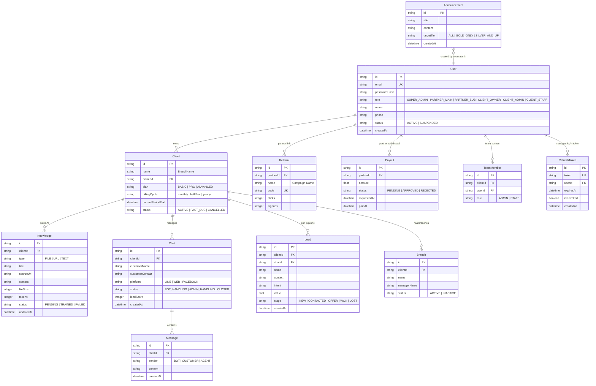

# แผนการพัฒนา Backend & Database และสถาปัตยกรรมความปลอดภัยสำหรับระบบ AIVA (Secure Backend Integration Plan)

เอกสารฉบับนี้กำหนดโครงสร้างสถาปัตยกรรมหลังบ้าน โครงสร้างฐานข้อมูล มาตรการความปลอดภัยเชิงรุกเพื่อป้องกันช่องโหว่ความปลอดภัยตามมาตรฐาน OWASP Top 10 และแผนการดำเนินงานของระบบ AIVA เพื่อเปลี่ยนผ่านจากระบบจำลอง (Static Frontend) ไปสู่ระบบจริง (Production Server)

---

## 1. การเลือกเทคโนโลยี (Tech Stack Selection)

* **Backend Framework:** **Node.js กับ Express** ( CommonJS โครงสร้างแบบแยกสัดส่วนเพื่อรองรับการขยายตัว)
* **ORM (Object-Relational Mapping):** **Prisma ORM (v6)** (รองรับคิวรีผ่าน Parameterized Query และเสถียรสำหรับการใช้งานบน Windows)
* **Database:** **PostgreSQL** สำหรับโปรดักชัน และใช้ **SQLite** สำหรับสภาพแวดล้อมจำลองระดับพัฒนา (Local Dev)
* **Authentication:** **JWT (JSON Web Token)** พร้อมระบบการต่ออายุสิทธิ์ผ่าน httpOnly Cookie และเก็บสถานะลงในตาราง Refresh Token
* **Security Tooling:** **Helmet.js** (ตั้งค่า HTTP Header ป้องกันเบราว์เซอร์ลักลอบโจมตี), **BcryptJS** (แฮชรหัสผ่านความปลอดภัยสูงด้วย Salt 10 รอบ), **Express-Validator** (ทำความสะอาดและคัดกรองข้อมูลนำเข้า)
* **Real-time Engine:** **Socket.io** (สำหรับระบบแชทสดในเมนู AIVA Inbox & Chat แบบเรียลไทม์)

---

## 2. โครงสร้างฐานข้อมูล (Database Schema - Prisma Data Model)

ฐานข้อมูลมีโครงสร้างรองรับผู้ใช้หลายแบรนด์แยกสิทธิ์ (Multi-Tenant System) และเก็บข้อมูลคู่โทเคนหมุนเวียน:

---

## 3. มาตรการรักษาความปลอดภัย (Security Implementations)

ระบบหลังบ้านของ AIVA ปิดช่องโหว่ความมั่นคงปลอดภัยสารสนเทศหลักตามกรอบ OWASP Top 10 ดังนี้:

### 3.1 การป้องกันการโจมตี Injection (Anti-Injection)
* **SQL Injection Prevention:** คิวรีผ่าน **Prisma ORM** ซึ่งจะแยกโครงสร้างคำสั่งคิวรีออกจากตัวแปรนำเข้าด้วย Parameterized Queries เสมอ แฮกเกอร์ไม่สามารถแอบใส่คำสั่ง SQL แปลกปลอมได้
* **XSS (Cross-Site Scripting) & Parameter Validation:** ใช้ **Express-Validator** คัดกรองและฆ่าเชื้อข้อมูลนำเข้า (Sanitization) ด้วยคำสั่ง `.trim()` และ `.escape()` เพื่อแปลงอักขระพิเศษที่เป็นอันตราย (เช่น `<script>`) ให้อยู่ในรูปข้อความธรรมดาที่ปลอดภัย
* **HTTP Hardening (Helmet):** การใช้ `helmet()` ป้องกันเบราว์เซอร์ถูกครอบงำด้วย MIME Sniffing และ Clickjacking

### 3.2 การป้องกัน Broken Access Control
* **Role-Based Access Control (RBAC):** สร้าง Middleware ในการสกัดกั้นการเข้าถึงหน้า API ตามบทบาทของบัญชี (Role) เช่น:
  - `authorizeRoles('SUPER_ADMIN')`
  - `authorizeRoles('PARTNER_MAIN', 'PARTNER_SUB')`
* **Multi-Tenant Protection (BOLA/IDOR Prevention):** ติดตั้งระบบ Middleware `checkTenantAccess(resourceModel)` เพื่อตรวจเช็คความเป็นเจ้าของข้อมูลร้านค้า รหัส Client ID ของแอดมินผู้เข้าใช้งานจะต้องตรงกับรหัส Client ID ของแถวข้อมูลเป้าหมายในตาราง (เช่น ตารางแชท หรือ CRM Leads) หากไม่ตรงกันระบบจะตอบกลับ `403 Access Denied` ทันที ป้องกันการแอบส่องข้อมูลข้าม tenant

### 2.3 ระบบยืนยันตัวตน JWT Auth + Refresh Token Rotation (RTR)
* **การเก็บ Token ที่ปลอดภัย:**
  - **Access Token:** ส่งผ่าน HTTP Header (`Authorization: Bearer <token>`) อายุใช้งานสั้น (15 นาที)
  - **Refresh Token:** ส่งผ่านระบบ **httpOnly Cookie** อายุใช้งาน 7 วัน ตั้งค่าความปลอดภัยสูงสุด `secure=true` (ส่งผ่าน HTTPS เท่านั้น) และ `sameSite='strict'` เพื่อปิดโอกาสการถูกขโมยผ่าน Javascript และป้องกันการโจมตี CSRF
* **Refresh Token Rotation (RTR):** ทุกครั้งที่มีการขอต่ออายุคีย์ (Refresh Token Request) คีย์เก่าจะถูกเปลี่ยนสถานะเป็นยกเลิก (Revoked) และสร้างคีย์ใหม่ส่งกลับแทนที่ (Rotation)
  - **Security Countermeasure:** หากพบการพยายามนำคีย์เก่าที่ถูกยกเลิกไปแล้วมาใช้ซ้ำ ระบบจะถือว่าเกิดการขโมยคีย์ขึ้น และจะทำลายเซสชันการล็อกอินทั้งหมดของผู้ใช้งานคนนั้นทันที (Force Revoke All User Sessions) เพื่อความปลอดภัยสูงสุด

---

## 4. รายการ API Endpoints หลัก (RESTful API Design)

### 4.1 Authentication & Auth Control
* `POST /api/auth/register` - สมัครบัญชีใหม่ (เจ้าของร้านค้า / พาร์ทเนอร์) (ใช้ `registerRules`)
* `POST /api/auth/login` - เข้าสู่ระบบรับ JWT Token (ใช้ `loginRules`)
* `POST /api/auth/refresh` - ต่ออายุ Access Token และหมุนเวียนคีย์ Refresh Token
* `POST /api/auth/logout` - ยกเลิกคีย์และล้าง Cookie
* `GET /api/auth/me` - ดึงรายละเอียดเซสชันปัจจุบันของผู้ล็อกอิน

### 4.2 Client Platform (สำหรับแอดมินร้านค้า)
* `GET /api/client/dashboard/stats` - ดึงข้อมูลสรุปการทำงาน ยอดขาย และโทเคนคงเหลือ
* `GET /api/client/knowledge` - ดึงรายการคลังข้อมูลสมอง AI
* `POST /api/client/knowledge/upload` - อัปโหลดข้อความ ป้อนลิงก์ หรืออัปโหลดไฟล์เทรนบอท AIVA
* `GET /api/client/chats` - รายการบทสนทนา (แยกตามระดับความสนใจ Lead Score)
* `GET /api/client/chats/:id/messages` - ดึงประวัติข้อความของห้องแชทลูกค้ารายการนั้นๆ (ตรวจสอบสิทธิ์ Tenant)
* `POST /api/client/chats/:id/send` - แอดมินพิมพ์ข้อความตอบกลับลูกค้าแบบเรียลไทม์ (ตรวจสอบสิทธิ์ Tenant)
* `GET /api/client/leads` - ข้อมูลผู้สนใจและ Deal Stages บนหน้าบอร์ด CRM
* `POST /api/client/leads` - บันทึกการย้าย Deal Stage (ใช้ `createLeadRules`)
* `GET /api/client/team` - ตรวจสอบรายชื่อทีมและเชิญแอดมินเพิ่ม
* `POST /api/client/settings` - บันทึกข้อมูลแบรนด์และการตั้งค่าบอท

### 4.3 Partner Portal (สำหรับพาร์ทเนอร์)
* `GET /api/partner/stats` - ดึงยอดขาย คอมมิชชันสะสมของเดือนปัจจุบัน
* `GET /api/partner/referrals` - แสดงสถิติการสร้างลิงก์เชิญ Affiliate
* `POST /api/partner/referrals` - บันทึกการเพิ่มลิงก์แคมเปญเชิญใหม่
* `GET /api/partner/network` - แสดงรายชื่อ Sub-Partners ภายใต้สายงาน
* `POST /api/partner/payouts/request` - ยื่นส่งใบคำขอเบิกถอนเงินส่วนแบ่ง

### 4.4 Super Admin Portal (สำหรับผู้ดูแลระบบสูงสุด)
* `GET /api/admin/partners` - รายการบัญชีพาร์ทเนอร์รออนุมัติ KYC
* `POST /api/admin/partners/:id/kyc` - เปลี่ยนแปลงสถานะ KYC (อนุมัติ / ปฏิเสธ)
* `GET /api/admin/payouts` - รายงานรายการขอถอนเงินและบันทึกการโอนเงิน
* `POST /api/admin/broadcast` - ส่งประกาศหรือประกาศแคมเปญใหม่ไปยังพาร์ทเนอร์ทุกคน

---

## 5. ข้อมูลบัญชีจำลองตั้งต้น (Seeded Mock Accounts)

ฐานข้อมูลเริ่มต้นมีข้อมูลจำลองที่พร้อมรับการทดสอบสิทธิ์ความปลอดภัยดังนี้ (ข้อมูลรหัสผ่านทั้งหมดผ่านการเข้ารหัส bcrypt ในระบบ):

| บทบาท (Role) | บัญชีผู้ใช้ (Username/Email) | รหัสผ่าน (Password) | รายละเอียดจำลอง |
| --- | --- | --- | --- |
| **Super Admin** | `ROOT-01` | `password` | ผู้ดูแลระบบจัดการ KYC และระบบจ่ายเงินคอมมิชชันพาร์ทเนอร์ |
| **Partner** | `P88942` | `password` | บัญชีพาร์ทเนอร์ สมชาย ใจดี, คอมมิชชัน 18% |
| **Client Owner** | `admin@globaltech.com` | `password` | บัญชีเจ้าของร้านค้า Global Tech Solution, แพลน PRO |

---

## 6. แผนงานการดำเนินการ (Implementation Roadmap)

1. **Phase 1: Setup & Database Setup (เสร็จสิ้น)**
   - สรรสร้างโฟลเดอร์ `server` และติดตั้ง npm packages
   - เขียนโครงสร้างตารางข้อมูลใน `schema.prisma` รองรับ SQLite และ JWT RTR
   - พัฒนาสคริปต์ `seed.js` และสร้างฐานข้อมูลพร้อมรันข้อมูลจำลองตั้งต้น
2. **Phase 2: Authentication & Access Control (เสร็จสิ้น)**
   - ระบบยืนยันตัวตน JWT Auth ร่วมกับ Refresh Token (Cookie)
   - Middlewares ป้องกันการโจมตี Injection และ Broken Access Control (RBAC/Multi-Tenant)
   - พัฒนาเส้นทางและ Logic ระบบ Login, Register, Refresh, Logout ของพนักงาน พาร์ทเนอร์ และแอดมินสูงสุด
3. **Phase 3: Core API Logic Integration (เสร็จสิ้น)**
   - พัฒนาโครงสร้าง Endpoint และ Logic สำหรับระบบจัดการ Client Platform (ระบบคลังความรู้ AI, ประวัติข้อความแชทเรียลไทม์, บอร์ดสเตจ CRM, แอดมินและทีมงาน), Partner Portal (ระบบสถิติลิ้งก์แนะนำ, การจัดการ Sub-Partners, คำขอเบิกเงินคอมมิชชัน), และ Super Admin Portal (ระบบอนุมัติ KYC เอกสารพาร์ทเนอร์, การจ่ายเงิน Payouts, การส่งประกาศบรอดแคสต์แคมเปญ)
4. **Phase 4: Frontend Integration & Deployment (เสร็จสิ้น)**
   - เชื่อมต่อทุกหน้า UI (LandingPage, Platform, Partner, SuperAdmin) เข้ากับ Express backend API สำเร็จเรียบร้อย
   - ทดสอบการดึงข้อมูลและบันทึกข้อมูลแบบ Dynamic (CRM leads, สมาชิกทีมงาน, KYC Verification, Payout Approvals)
   - ระบบรักษาความปลอดภัย OWASP Top 10 (Anti-Injection, RBAC, BOLA/IDOR protection) ทำงานเต็มรูปแบบ
   - ทำการทดสอบ E2E Test (Robot Framework) ทั้งหมดผ่านฉลุย 100% (4/4 passed) ยืนยันเสถียรภาพระดับ Production
