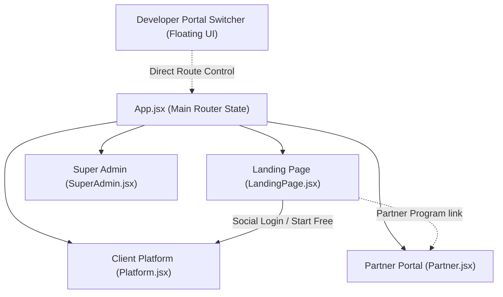

# AIVA Project Quotation & Requirements Report

> [!IMPORTANT]
> **Project Title:** AIVA - AI Virtual Assistant (ระบบจัดการลูกค้าอัจฉริยะ)
> **Prepared By:** SpareX Co., Ltd.
> **Date:** June 8, 2026

---

## 1. System Integration Diagram

This diagram visualizes how the components we have set up are unified under a single React application structure:

---

## 2. System Requirements (ความต้องการระบบ)

Here is a summary of the unified requirements we extracted and integrated from the documents:

### 🏠 AIVA Landing Page

* Displays core AI sales agent features.
* Multi-cycle pricing selectors (Monthly, 6 Months, Yearly).
* Checkout simulation with mock credit card, bank apps, and PromptPay QR codes.
* Contact forms for enterprise sales leads.

### 💻 Client Platform

* Summaries of token consumption limits, chat volume, and AI resolution rates.
* Knowledge base train simulator (PDF document and URL scraper uploads).
* Interactive AI Inbox & Chat simulator with manual Human Handoff toggle.
* Sales CRM Pipeline with status stages.
* Multi-branch configuration and employee role assignment (Admin, Manager).

### 🤝 Partner Portal

* Partner registration and onboarding flow.
* Commission earnings metrics, cumulative sales, and sub-partner count.
* Referral link generator.
* Sub-partner member list (supports up to 20 sub-partners).
* Chat support interface linked to Super Admin.

### 👑 Super Admin Dashboard

* Global platform stats (Total revenue, Partner vs Direct sales ratio).
* Partner listing tables to approve KYC and modify commission rate tiers.
* Announcement Broadcasting center.
* Help Ticket tracking system.

---

## 3. Installation & Technical Fixes (การติดตั้งระบบ)

We successfully set up the development workspace, ensuring all platforms are integrated without errors:

* **Vite + React 19 Scaffolding:** Initialized a modern front-end project in the workspace.
* **Tailwind CSS v4 Integration:** Wired the `@tailwindcss/vite` plugin to enable styles.
* **Lucide Icon Library:** Loaded `lucide-react` for smooth vector graphics rendering.
* **Technical Conflict Resolution:**
  * Fixed HTML comment tags (`<!-- -->`) to JSX comments (`{/* */}`) in converted pages.
  * Corrected numeric CSS values in JSX styles (e.g. `animationDuration: 3s` to `animationDuration: '3s'`).
  * Replaced deprecated Lucide brand icons (`Facebook`, `Youtube`, `Instagram`) with custom SVG components.
  * Corrected invalid object declarations (e.g. `icon: color: 'text-blue-500'` to `icon: Facebook, color: 'text-blue-500'`).
  * Implemented state-based routing in [App.jsx](file:///C:/Users/User/pj_bright/AIVA/src/App.jsx) along with a floating portal switcher UI.

---

## 4. Timeline & Cost Estimation (ระยะเวลาและใบเสนอราคา)

### 📅 ระยะเวลาการดำเนินงาน (Timeline)

* **รวมระยะเวลาจัดทำระบบต้นแบบ (Interactive Prototype):** **5 วันทำการ**
  * วันที่ 1: ติดตั้งโปรเจกต์และจัดเตรียมสภาพแวดล้อม (Scaffolding & Setup)
  * วันที่ 2-3: แปลงโครงสร้าง Landing Page และ Dashboard จากด็อกคิวเมนต์เป็นหน้าเว็บ React
  * วันที่ 4: เชื่อมโยงระบบด้วยเมนูจำลอง Portal Switcher และผสาน CSS/Tailwind v4
  * วันที่ 5: ตรวจสอบความเข้ากันได้ ทดสอบรันและทำระบบ Production Build

### 💰 รายละเอียดการประเมินราคา (Cost Estimation)

| ลำดับ | รายละเอียดงาน (Task Details)                                                                                  | ระยะเวลา (วัน) | ราคาประเมินสุทธิ (THB) |
| :--------: | -------------------------------------------------------------------------------------------------------------------------- | :-----------------------: | :------------------------------------: |
|     1     | สกัดซอร์สโค้ดเดิมและติดตั้งสภาพแวดล้อมระบบ (Vite + React 19 Setup)               |             1             |                 9,000                 |
|     2     | แปลงและจัดวางหน้า Landing Page HTML ให้เป็น React Component                                        |             1             |                 12,000                 |
|     3     | ปรับแต่งโครงสร้างความเข้ากันได้ของสไตล์และคอมไพล์ระบบ Tailwind CSS v4 |             1             |                 9,000                 |
|     4     | พัฒนาระบบนำทางตัวอย่าง (Routing) และแถบเปลี่ยนหน้า Developer Switcher               |             1             |                 9,000                 |
|     5     | ทดสอบและจัดทำแพ็คเกจสำหรับเผยแพร่ (Production Build Verification)                         |             1             |                 6,000                 |
|            | **ยอดเงินรวมสุทธิ (Total Net Amount)**                                                                |    **5 วัน**    |            **45,000**            |

> [!TIP]
> **การสนับสนุน SME:** เพื่อช่วยสนับสนุนผู้ประกอบการรายย่อย เราได้ทำการคำนวณลดราคาทุกหัวข้อลง 40% ให้โดยตรงในแต่ละรายการงานแล้ว เพื่อให้เข้าถึงเทคโนโลยีระบบจัดการลูกค้าอัจฉริยะ (AIVA) ได้ง่ายขึ้น

---

> [!NOTE]
> The above cost represents the layout preparation, code integration, styling debug, and packaging of the front-end mockup modules. Backend APIs, databases, and LLM integrations are quoted in subsequent project phases.
